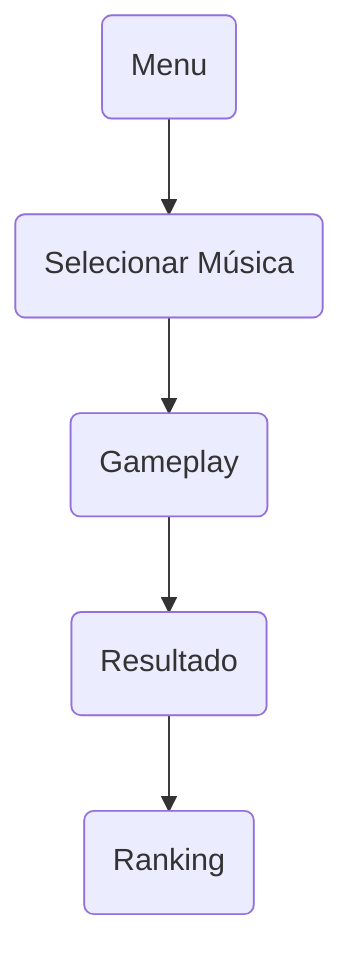

![[Guitar_hero_logo.png]]

# Project[BeatSinger]

>[!info] Project
>BeatSinger • Godot 4.7+ • C# • BeatSinger Game 2D
>
>Status: Development 

---
## Overview 

>[!abstract] > Jogo de Ritmo inspirado em Friday night funkin
>

## Information 

| Item | Valor |
|:----|:------|
| Engine | Godot 4.7+ |
| Linguagem | C# |
| Plataforma | Windows |
| Gênero | Rhythm Game |
| Resolução | 1920x1080 |

---

## 🎮 Gameplay

> [!tip]
>
> - Escolher música
> - Escolher dificuldade
> - Acertar notas
> - Aumentar combo
> - Evitar Miss
> - Obter Rank S

---

## 🎹 Controles

| Tecla | Função |
|------|---------|
| **A** | Coluna 1 |
| **S** | Coluna 2 |
| **D** | Coluna 3 |
| **F** | Coluna 4 |
| **ESC** | Pause |

---

## ⭐ Mecânicas

```text
Score
Combo
Accuracy
Life
Multiplier
Ranking
Save
```

---

## 📂 Estrutura

```text
📦 RhythmHero
├── Assets
├── Audio
├── Beatmaps
├── Scenes
├── Scripts
├── UI
└── Saves
```

---

## 🖥️ Cenas

```text
MainMenu
SongSelect
Gameplay
Pause
Results
Settings
```

---

## 📜 Scripts

```text
GameManager
AudioManager
BeatmapLoader
ScoreManager
ComboManager
SaveManager
Note
Lane
```

---

## 📦 Recursos

> [!example]
>
> - 🎵 Música (.ogg)
> - 📄 Beatmap (.json)
> - 🖼️ Sprites
> - 🔊 SFX
> - 🔤 Fontes

---

## 🔄 Fluxo



---

## 📌 Checklist

> [!check]

- [ ] Gameplay
- [ ] Beatmap
- [ ] Input
- [ ] Score
- [ ] Combo
- [ ] Accuracy
- [ ] Ranking
- [ ] Save
- [ ] Configurações
- [ ] Polimento

![[Buttons, Pre Animation and Arrows.png|355]]

>[!example] Musics
>Tutorial
>Awaken your dreams
>


